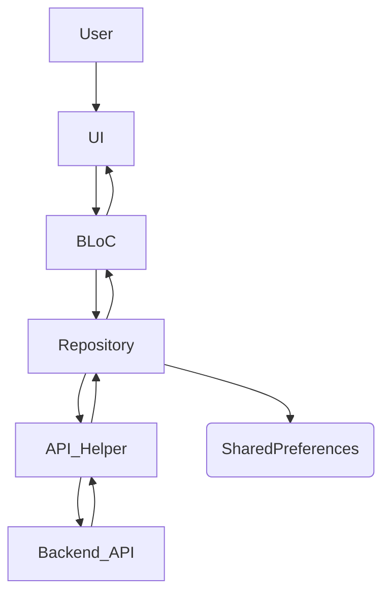

# 🛒 ShopSphere

[](https://flutter.dev/)
[](https://dart.dev/)
[](https://bloclibrary.dev/)

ShopSphere is a modern, cross-platform e-commerce application built with Flutter, designed to provide a seamless shopping experience. It features robust user authentication, dynamic product listings, efficient cart management, and personalized user profiles, all powered by a scalable architecture.

## 🎯 Key Features

*   **User Authentication:** Secure login and registration flows with input validation.
*   **Dynamic Product Listing:** Browse a wide range of products with an engaging UI, including a carousel banner and product grid.
*   **Shopping Cart Management:** Add items to the cart, adjust quantities, and proceed to checkout.
*   **User Profile:** View personal details, manage app settings like dark/light mode, and securely log out.
*   **State Management:** Utilizes the BLoC pattern for predictable and maintainable state handling across the application.
*   **Local Data Storage:** Integrates `shared_preferences` for managing user sessions and tokens.
*   **Theme Switching:** Seamlessly toggle between light and dark modes for a personalized user experience.
*   **API Integration:** Communicates with backend services for data fetching and transaction processing.
*   **Animations:** Incorporates Lottie animations for a more interactive and visually appealing interface.

## 🏗️ Architecture Overview

ShopSphere employs the BLoC (Business Logic Component) pattern combined with a Repository layer, promoting a clear separation of concerns and testability.



**Flow Explanation:**
1.  **User Interaction:** The user interacts with the **UI** (e.g., taps a login button, adds a product to cart).
2.  **Event Dispatch:** The **UI** dispatches an **Event** to the corresponding **BLoC**.
3.  **Business Logic:** The **BLoC** receives the event, processes any business logic, and then calls the appropriate method in a **Repository**.
4.  **Data Fetching/Manipulation:** The **Repository** is responsible for fetching data from either a **Backend API** (via `API_Helper`) or **Local Storage** (e.g., `SharedPreferences` for tokens).
5.  **Data Response:** The data is returned from the **API_Helper** or **Local Storage** back to the **Repository**, and then to the **BLoC**.
6.  **State Emission:** Based on the data received and any further business logic, the **BLoC** emits a new **State**.
7.  **UI Update:** The **UI** listens to changes in the **BLoC's State** and rebuilds itself accordingly, displaying the updated information or handling errors.

## 🛠️ Technology Stack

| Technology/Library    | Version  | Purpose                                   |
| :-------------------- | :------- | :---------------------------------------- |
| Flutter               | ^3.8.0   | UI Framework for cross-platform development |
| Dart                  | ^3.8.0   | Programming Language                      |
| http                  | ^1.4.0   | Making HTTP requests to APIs              |
| flutter_bloc          | ^9.1.1   | State management library (BLoC pattern)   |
| lottie                | ^3.3.1   | Displaying Lottie animations              |
| shared_preferences    | ^2.5.3   | Local data storage for user preferences   |
| google_fonts          | ^6.2.1   | Custom fonts for enhanced UI              |
| carousel_slider       | ^5.1.1   | Image carousel for banners                |
| carousel_indicator    | ^1.0.6   | Indicator for carousel slider             |
| flutter_launcher_icons| ^0.14.4  | Generating app launcher icons             |
| rename_app            | ^1.6.5   | Renaming the Flutter application          |
| provider              | ^6.1.5   | State management (for ThemeProvider)      |
| cupertino_icons       | ^1.0.8   | iOS-style icons for Flutter               |
| flutter_lints         | ^5.0.0   | Linting rules for good coding practices   |

## 🚀 Getting Started

Follow these steps to set up and run the ShopSphere project on your local machine.

### Prerequisites

*   **Flutter SDK:** Ensure you have Flutter installed. You can download it from [flutter.dev](https://flutter.dev/docs/get-started/install).
*   **Git:** For cloning the repository.
*   **IDE:** Visual Studio Code or Android Studio with Flutter and Dart plugins.

### Installation

1.  **Clone the repository:**
    ```bash
    git clone https://github.com/cybersleuth0/ShopSphere.git
    cd ShopSphere
    ```
2.  **Install dependencies:**
    ```bash
    flutter pub get
    ```
3.  **Run the application:**
    ```bash
    flutter run
    ```
    This will launch the application on your connected device or emulator.

## 📂 Project Structure

```
.
├── lib/
│   ├── UI/
│   │   ├── Auth/                 # Authentication features (Login, Signup)
│   │   │   ├── Login/
│   │   │   │   ├── Bloc/         # BLoC logic for Login
│   │   │   │   └── login_page.dart
│   │   │   └── Signup/
│   │   │       ├── Bloc/         # BLoC logic for Signup
│   │   │       └── Signup_page.dart
│   │   ├── ecom/                 # Core e-commerce features
│   │   │   ├── Profile/          # User profile management
│   │   │   │   ├── Bloc/
│   │   │   │   └── profile.dart
│   │   │   ├── dashboard/        # Homepage with product listings
│   │   │   │   ├── Bloc/
│   │   │   │   └── homepage.dart
│   │   │   ├── orderPlace/       # Cart and order placement
│   │   │   │   ├── Bloc/
│   │   │   │   └── cartPage.dart
│   │   │   └── product_detail/   # Product details and cart interaction
│   │   │       └── Bloc/
│   │   ├── SplashScreen.dart     # Initial splash screen
│   │   └── themeProvider.dart    # Theme management using Provider
│   ├── data/
│   │   ├── remote/
│   │   │   ├── helper/           # API helper for network calls
│   │   │   ├── models/           # Data models (Product, Cart)
│   │   │   └── repositories/     # Data repositories (User, Product, Cart, Order)
│   └── utils/
│       └── constants/            # Application constants and routes
├── Assets/                       # Application assets (Lottie animations, images, icons)
├── pubspec.yaml                  # Project dependencies and metadata
└── README.md                     # Project README
```

## 📈 Future Enhancements

*   **Product Details Page:** Implement a dedicated page for detailed product information.
*   **Search Functionality:** Enhance the search bar to filter products.
*   **Payment Gateway Integration:** Integrate with a real payment gateway for secure transactions.
*   **Order History:** Allow users to view their past orders.
*   **Wishlist Functionality:** Add the ability for users to save favorite products.
*   **User Profile Editing:** Enable users to update their profile information.
*   **Review and Rating System:** Implement a system for product reviews.
*   **Notifications:** Add push notifications for order updates or promotions.
*   **Unit & Integration Tests:** Expand test coverage for improved reliability.
