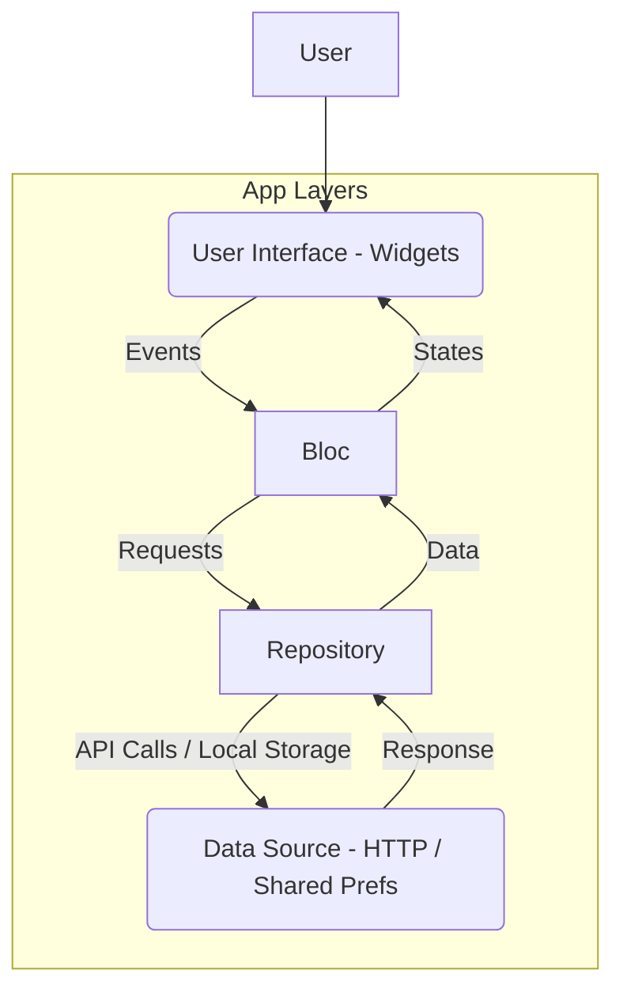

# 🛒 FlutterEcom

A modern e-commerce application built with Flutter, showcasing a clean architecture and responsive UI.

[](https://flutter.dev/)
[](https://dart.dev/)
[](https://bloclibrary.dev/)

## 🎯 Key Features

*   **Robust State Management**: Utilizes the BLoC pattern for predictable and testable state management.
*   **API Integration**: Handles network requests for fetching product data and other e-commerce content.
*   **Interactive UI**: Incorporates Lottie animations for engaging user experiences.
*   **Local Data Persistence**: Leverages shared preferences for storing simple user data or settings locally.
*   **Dynamic Carousels**: Features image and content carousels with indicators for showcasing products or banners.
*   **Custom Font Support**: Integrates Google Fonts for enhanced typography and branding.

## 🏗️ Architecture Overview

This project follows the **BLoC (Business Logic Component)** architectural pattern, separating the presentation layer from the business logic. This promotes a clean, testable, and scalable codebase.



**Flow Explanation:**
1.  **User Interaction**: The user interacts with the `UI` (Flutter Widgets).
2.  **Events**: User interactions trigger `Events` that are dispatched to the `Bloc`.
3.  **Bloc Processing**: The `Bloc` receives `Events`, processes the business logic, and interacts with the `Repository`.
4.  **States**: Based on the processing, the `Bloc` emits new `States`, which the `UI` listens to.
5.  **UI Updates**: The `UI` rebuilds itself to reflect the new `State`.
6.  **Repository**: The `Repository` acts as an abstraction layer, handling data operations and deciding whether to fetch data from remote `Data Sources` (APIs) or local `Data Sources` (e.g., Shared Preferences).
7.  **Data Source**: The `Data Source` performs the actual data fetching (e.g., HTTP requests) or storage operations.

## 🛠️ Technology Stack

| Technology/Library   | Version   | Purpose                                          |
| :------------------- | :-------- | :----------------------------------------------- |
| Flutter SDK          | ^3.8.0    | UI Toolkit for cross-platform development        |
| Dart SDK             | ^3.8.0    | Programming Language                             |
| `flutter_bloc`       | ^9.1.1    | State management using the BLoC pattern          |
| `http`               | ^1.4.0    | Making HTTP requests to external APIs            |
| `lottie`             | ^3.3.1    | Displaying Lottie animations for rich UI         |
| `shared_preferences` | ^2.5.3    | Persisting simple key-value data locally         |
| `google_fonts`       | ^6.2.1    | Easily use fonts from fonts.google.com           |
| `carousel_slider`    | ^5.1.1    | Customizable carousel widget for images/content  |
| `carousel_indicator` | ^1.0.6    | Visual indicators for carousel slides            |
| `cupertino_icons`    | ^1.0.8    | iOS-style icons for Flutter applications         |
| `flutter_lints`      | ^5.0.0    | Recommended lint rules for encouraging good practices |

## 🚀 Getting Started

Follow these steps to get the project up and running on your local machine.

### Prerequisites

*   [Flutter SDK](https://flutter.dev/docs/get-started/install) (version `3.8.0` or higher recommended)
*   [Git](https://git-scm.com/book/en/v2/Getting-Started-Installing-Git)

### Installation

1.  **Clone the repository:**
    ```bash
    git clone https://github.com/cybersleuth0/FlutterEcom.git
    cd FlutterEcom
    ```

2.  **Install dependencies:**
    ```bash
    flutter pub get
    ```

3.  **Run the application:**
    ```bash
    flutter run
    ```
    This command will launch the application on your connected device or emulator.

## 📂 Project Structure

The project adheres to a standard Flutter project structure, with key directories for source code, assets, and platform-specific files.

```
flutter_ecom/
├── lib/                      # Contains the main Dart source code for the application
├── assets/                   # Stores static assets like images and Lottie animations
│   ├── LottieAnimations/     # Lottie JSON animation files
│   └── image/                # Image assets
├── android/                  # Android specific project files
├── ios/                      # iOS specific project files
├── pubspec.yaml              # Project dependencies and metadata
├── .gitignore                # Files and directories to be ignored by Git
├── .metadata                 # Flutter project metadata
└── analysis_options.yaml     # Dart analyzer lint rules
```

## 📈 Future Enhancements

*   **User Authentication**: Implement user registration, login, and profile management.
*   **Shopping Cart Functionality**: Add features to add/remove products from a cart, update quantities, and calculate totals.
*   **Payment Gateway Integration**: Integrate with popular payment services for secure transactions.
*   **Product Detail Pages**: Develop dedicated screens for detailed product information, reviews, and related items.
*   **Search and Filter**: Implement robust search and filtering capabilities for products.
