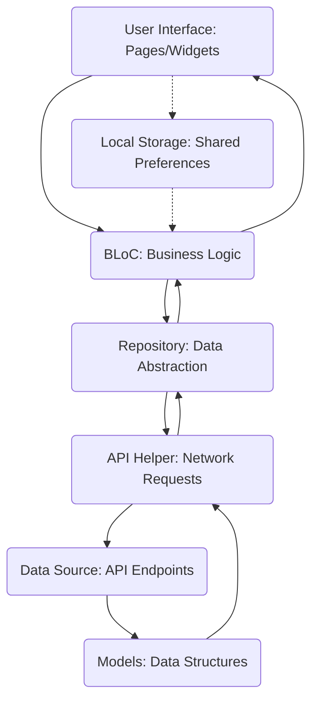

# 🛒 FlutterEcom

[](https://flutter.dev/)
[](https://dart.dev/)
[](https://bloclibrary.dev/)

FlutterEcom is a modern e-commerce mobile application built with Flutter, designed to provide a seamless shopping experience. It features robust user authentication, a dynamic product catalog, detailed product views, and a functional shopping cart, all powered by the BLoC state management pattern for a clean and scalable architecture.

## 🎯 Key Features

*   **User Authentication:** Secure login and registration flows with input validation.
*   **Splash Screen:** Initial loading screen with token-based navigation to home or login.
*   **Product Listing:** Browse a variety of products on the dashboard with a responsive grid view.
*   **Product Details:** View comprehensive information about individual products, including description, specifications, and reviews.
*   **Shopping Cart:** Add products to the cart, view cart items, and manage quantities (initial implementation).
*   **User Profile Management:** View and manage user profile details.
*   **State Management:** Utilizes the BLoC pattern for predictable and maintainable state handling.
*   **API Integration:** Communicates with a backend API for data fetching and updates.
*   **Local Storage:** Uses `shared_preferences` to persist user authentication tokens.
*   **Interactive UI:** Features like carousel sliders for banners and animated components (Lottie animations).

## 🏗️ Architecture Overview

This project adopts a BLoC (Business Logic Component) architecture combined with a Repository pattern, promoting a clear separation of concerns and testability.



**Flow Explanation:**

1.  **User Interaction (UI):** When a user performs an action (e.g., clicks login, fetches products), the UI dispatches an `Event` to the corresponding `BLoC`.
2.  **BLoC (Business Logic):** The BLoC receives the `Event`, processes the business logic (e.g., validates input, prepares data), and then calls the appropriate method in the `Repository`. It also manages the state of the UI by emitting different `States` (e.g., Loading, Success, Failure).
3.  **Repository (Data Abstraction):** The Repository acts as an abstraction layer for data sources. It decides whether to fetch data from a remote API via `ApiHelper` or from local storage (e.g., `shared_preferences`). It transforms raw data into application-specific `Models`.
4.  **API Helper (Network Requests):** This component is responsible for making actual HTTP requests to the backend `Data Source` (defined by `AppUrls`). It handles request headers (including authentication tokens from `Shared Preferences`), request bodies, and error handling for network communication.
5.  **Models (Data Structures):** Define the structure of data received from or sent to the API, ensuring type safety and easy manipulation within the application.
6.  **State Update (UI):** Once the BLoC receives data back from the Repository, it emits a new `State` (e.g., `LoginSuccessState`, `ProductSuccessState`). The UI listens to these states and rebuilds itself accordingly, displaying the fetched data or error messages.

## 🛠️ Technology Stack

| Technology/Library | Version | Purpose |
| :----------------- | :------ | :------ |
| Flutter            | ^3.8.0  | UI Framework for cross-platform app development. |
| `cupertino_icons`  | ^1.0.8  | iOS-style icons for Flutter applications. |
| `http`             | ^1.4.0  | Makes HTTP requests to interact with REST APIs. |
| `flutter_bloc`     | ^9.1.1  | State management solution for Flutter using BLoC pattern. |
| `lottie`           | ^3.3.1  | Renders Lottie animations for engaging UI. |
| `shared_preferences` | ^2.5.3 | Persists simple key-value data locally. |
| `google_fonts`     | ^6.2.1  | Easily use fonts from Google Fonts in Flutter. |
| `carousel_slider`  | ^5.1.1  | Provides a customizable carousel slider widget. |
| `carousel_indicator` | ^1.0.6 | Adds indicators for carousel sliders. |
| `flutter_lints`    | ^5.0.0  | Recommended lint rules for Dart and Flutter. |

## 🚀 Getting Started

Follow these steps to get a local copy of the project up and running on your machine.

### Prerequisites

*   [Flutter SDK](https://flutter.dev/docs/get-started/install) (version `3.8.0` or higher)
*   [Git](https://git-scm.com/downloads)
*   A code editor like [VS Code](https://code.visualstudio.com/) or [Android Studio](https://developer.android.com/studio)

### Installation

1.  **Clone the repository:**
    ```bash
    git clone https://github.com/cybersleuth0/FlutterEcom.git
    cd FlutterEcom
    ```

2.  **Install dependencies:**
    ```bash
    flutter pub get
    ```

3.  **Run the application:**
    ```bash
    flutter run
    ```
    *(Note: This project requires a backend API for full functionality. Ensure your API is running and configured correctly in `lib/utils/constants/app_urls.dart` if it's not already pointing to a public endpoint.)*

## 📂 Project Structure

The project follows a modular structure to ensure maintainability and scalability:

```
flutter_ecom/
├── lib/
│   ├── UI/                   # User Interface components (pages, widgets)
│   │   ├── Auth/             # Authentication related UI (Login, Signup)
│   │   │   └── Bloc/         # BLoC for Auth flows
│   │   ├── ecom/             # Main e-commerce features (Dashboard, Profile, Cart)
│   │   │   ├── dashboard/    # Product listing, homepage
│   │   │   ├── Profile/      # User profile management
│   │   │   ├── product_detail/# Product details and cart interaction
│   │   │   └── Bloc/         # BLoCs for e-commerce features
│   │   └── SplashScreen.dart # Initial splash screen
│   ├── data/                 # Data layer (models, repositories, API services)
│   │   ├── remote/           # Remote data sources
│   │   │   ├── helper/       # API helper, exception handling
│   │   │   ├── models/       # Data models (e.g., ProductModel, CartModel)
│   │   │   └── repositories/ # Abstraction for data operations (UserRepo, ProductRepo, CartRepo)
│   ├── utils/                # Utility classes and constants
│   │   └── constants/        # App constants, routes, API URLs
│   └── main.dart             # Main entry point of the application
├── Assets/                   # Static assets (images, Lottie animations)
│   ├── LottieAnimations/
│   └── image/
├── pubspec.yaml              # Project dependencies and metadata
└── README.md                 # Project documentation
```

## 📈 Future Enhancements

*   **Complete Cart Functionality:** Implement quantity updates, item removal, and total price calculation within the cart.
*   **Checkout & Payment Integration:** Add a full checkout process and integrate with a payment gateway.
*   **Search and Filters:** Implement robust search and filtering options for products.
*   **User Order History:** Allow users to view their past orders.
*   **Product Categories:** Organize products by categories for easier navigation.
*   **Wishlist Functionality:** Enable users to save favorite products to a wishlist.
*   **Push Notifications:** Implement notifications for order updates, promotions, etc.
*   **Improved Error Handling:** More user-friendly error messages and recovery options.
*   **Responsive Design Refinements:** Further optimization for various screen sizes and orientations.
